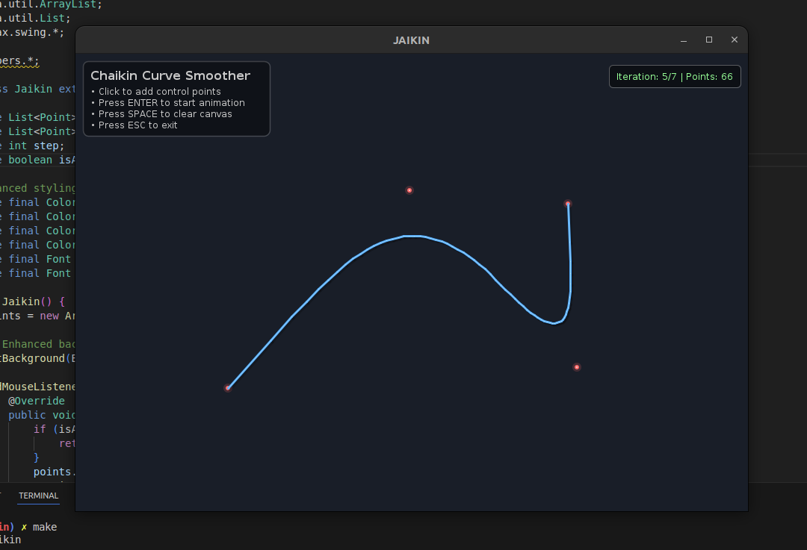

# Jaikin

A Java Swing application that demonstrates the **Chaikin curve smoothing algorithm** through interactive visualization.

## About

The Chaikin algorithm is a curve subdivision technique that transforms angular polygons into smooth curves by iteratively applying corner-cutting operations. This project provides a visual demonstration where users can create control points and watch the smoothing process in real-time.

## Demo


*Click to add points, press ENTER to start smoothing animation*

## Features

- 🎯 **Interactive Point Placement** - Click anywhere to add control points
- 🎬 **Real-time Animation** - Watch 7 iterations of smoothing
- 🎨 **Modern Dark UI** - Professional styling with glow effects
- ⌨️ **Simple Controls** - Mouse and keyboard interaction
- 📊 **Live Statistics** - Track iterations and point count

## How to Run

### Using Makefile
```bash
make run
```

### Controls
- **Click**: Add control point
- **ENTER**: Start animation (requires 3+ points)
- **SPACE**: Clear canvas
- **ESC**: Exit

## Project Structure

```
├── helpers/
│   ├── Chaikin.java     # Core algorithm implementation
│   └── Drawing.java     # Rendering and visual effects
├── Jaikin.java          # Main application and UI logic
├── Makefile             # Build automation
└── README.md            # This file
```

## Requirements

- Java 8 or higher
- Any operating system with Java support

---

*Educational tool for understanding geometric algorithms and curve subdivision techniques.*